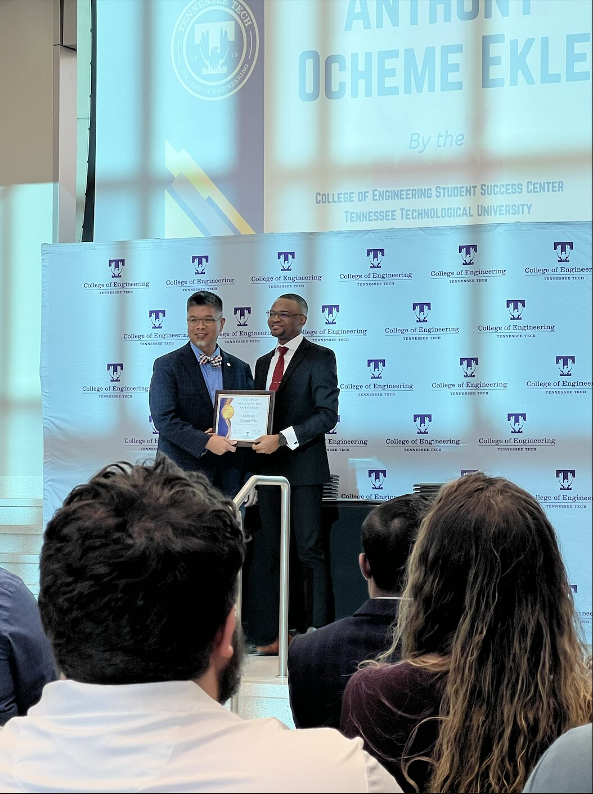
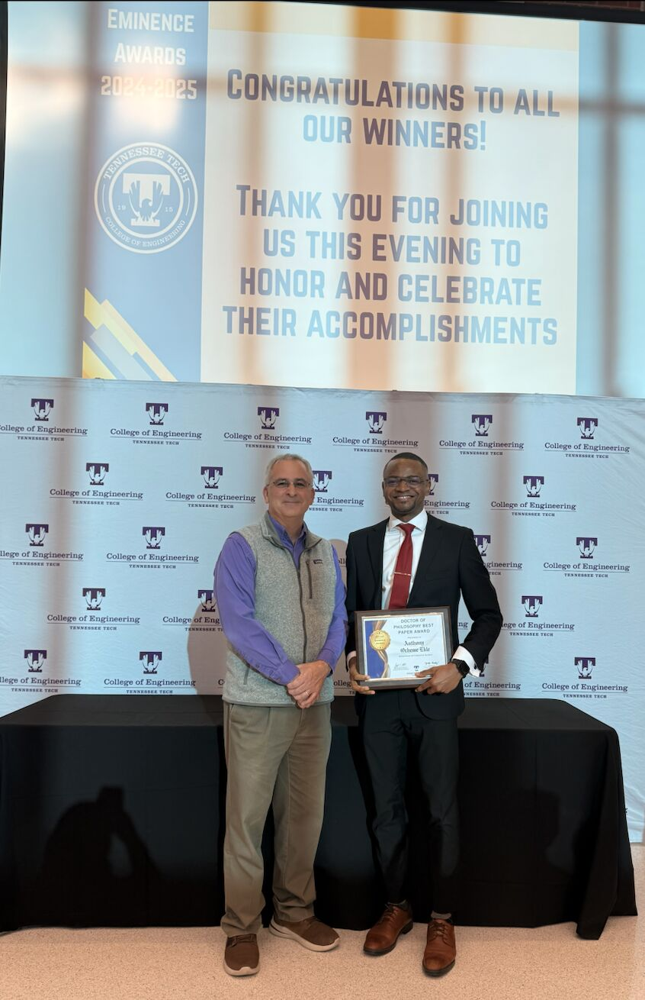

  

  

# 👋 Hey, I'm Anthony O. Ekle

### PhD Candidate (AI/ML) • Graph ML Researcher • Builder of Intelligent Learning Systems • 🏆 Best Paper Award 

I develop AI systems that learn from evolving networks, detect anomalies in real time, and make intelligent decisions from complex graph-structured data.

* 🧠 **Graph Machine Learning:** dynamic graph streams, anomaly detection, graph neural networks, representation learning
* 🚀 **AI Systems:** multimodal AI, self-supervised learning, scalable experimentation pipelines
* 🌎 **Geospatial AI:** spatial representation learning, climate AI, graph foundation models
* 🚗 **Autonomous Systems:** perception security, anomaly detection, trustworthy AI
* 🔐 **Cybersecurity AI:** vulnerability assessment, cyber risk evaluation, intelligent monitoring

📍 Based in Tennessee, USA

🎓 Currently completing a PhD in Computer Science at Tennessee Technological University.

---

# ⚡ TL;DR for Recruiters

* 🏆 Best Paper Award Winner (College of Engineering, Tennessee Tech)
* 📚 Published researcher with work in ACM TKDD, IEEE, FLAIRS, Applied Sciences, and other venues
* 🔬 Creator of Adaptive-DecayRank, Adaptive-GraphSketch, GeoModRank, and ViGAT
* 🤖 Research spanning Graph ML, GNNs, Multimodal AI, Geospatial AI, and Autonomous Vehicle Security
* 🐍 Strong experience in Python, PyTorch, C++, graph analytics, and scalable AI systems

If you need someone who can design algorithms, build AI systems, and publish impactful research, that's my lane.

---

# 🔗 Quick Links

---

# 🧩 What I'm Building

📈 **GraphSketch** :Memory-efficient real-time anomaly detection for dynamic graph streams using probabilistic sketching. 

🧠 **Adaptive-DecayRank**: Bayesian PageRank framework for real-time anomaly detection in evolving networks. 

🌎 **GeoModRank**: Self-supervised spatial representation learning for multimodal geospatial and climate data. 

🚗 **ViGAT**: Vision-to-Graph anomaly detection for autonomous vehicles and intelligent perception systems. 

---

# 🔬 Research Overview

My research focuses on building intelligent systems capable of learning from dynamic environments and making decisions under uncertainty.

Core research themes include:

* Dynamic Graph Learning
* Graph Neural Networks
* Multimodal & Geospatial AI
* Self-Supervised Learning
* Autonomous Vehicle Security

I am particularly interested in scalable AI systems that operate in real-world environments where data evolves continuously and intelligent adaptation is required.

---

# 🧪 Research Highlights (Selected)

* 📄 Adaptive GraphSketch: Real-Time Edge Anomaly Detection via Multi-Layer Tensor Sketching (IEEE ICKG 2025)
* 📄 Adaptive DecayRank: Real-Time Anomaly Detection in Dynamic Graphs with Bayesian PageRank Updates (Applied Sciences)
* 📄 Anomaly Detection in Dynamic Graphs: A Comprehensive Survey (ACM TKDD)
* 📄 Cyber Risk Evaluation for Android-Based Devices (IEEE DSC)
* 📄 Machine Learning Enhanced Categorization of Cybersecurity Vulnerabilities (IEEE UEMCON)
* 📄 Low-Resource Neural Machine Translation Using Transfer Learning (MIPT Research Thesis)

---

# 📄 Publications (Selected)

* **ViGAT: Vision-to-Graph Anomaly Detection for Autonomous Vehicles** — CVPR 2026 (Under Review) 

* **Adaptive-GraphSketch: Real-Time Edge Anomaly Detection via Multi-Layer Tensor Sketching** — IEEE ICKG 2025 

* **Adaptive DecayRank: Real-Time Anomaly Detection in Dynamic Graphs with Bayesian PageRank Updates** — Applied Sciences 2025 

* **Anomaly Detection in Dynamic Graphs: A Comprehensive Survey** — ACM TKDD 2024 

* **Dynamic PageRank with Decay** — FLAIRS 2024 

* **Cyber Risk Evaluation for Android-Based Devices** — IEEE DSC 2023 

* **Machine Learning Enhanced Categorization of Cybersecurity Vulnerabilities** — IEEE UEMCON 2024 

* **Low-Resource Neural Machine Translation for English–Igbo** — arXiv 2025 

# 🏆 Achievements & Honors

  
  

* 🥇 **Doctoral Best Paper Eminence Award** — Tennessee Tech College of Engineering
* 🥇 **Best Graduate Poster Award**
* 🎓 **Fully Funded PhD Fellowship**
* 🌍 **Open Doors International Olympiad Winner**
* 🎓 **University of Milan-Bicocca PhD Scholarship Recipient**
* 💻 **MIPT Phystech-Alpha Competition Award Recipient**

> Recognized for excellence in AI, Machine Learning, and Graph-Based Research.

---

# 🛠 Tech Stack

| 🤖 Machine Learning                           | 🧠 Generative AI                                    | ⚙️ AI Systems & MLOps             | 💻 Programming & Infrastructure |
| --------------------------------------------- | --------------------------------------------------- | --------------------------------- | ------------------------------- |
| • PyTorch, TensorFlow, Scikit-Learn           | • LLMs, LangChain, Hugging Face                     | • Real-Time Inference             | • Python, C++, SQL              |
| • Deep Learning (CNNs, Transformers)          | • RAG & Embeddings                                  | • Streaming Analytics             | • JavaScript, React             |
| • Graph Neural Networks (GCN, GAT, GraphSAGE) | • Vector Databases                                  | • Model Evaluation & Optimization | • Linux, Git, Docker            |
| • Graph Machine Learning                      | • Knowledge Graphs (Neo4j)                          | • Distributed Training            | • Conda, Jupyter                |
| • NLP & Multimodal Learning                   | • Agentic AI & AI Agents                            | • AI Infrastructure & AIOps       | • NVIDIA A100, Jetson           |
| • Anomaly Detection & Representation Learning | • Diffusion Models & Foundation Models              | • Scalable ML Systems             | • GPU-Accelerated Computing     |

---

# 🤝 Leadership & Service
* President, African Student Union (Tennessee Tech University)
* President, Computer Science Graduate Student Club
* Research Lead for Graph ML, Dynamic Graph Analytics, and Autonomous AI Systems projects
* Led interdisciplinary AI/ML initiatives spanning cybersecurity, geospatial AI, autonomous systems, and software engineering
* NSF REU Research Mentor, guiding undergraduate researchers in AI, Machine Learning, and Data Science
* Peer Reviewer for ACM TKDD, IEEE SMC, Pattern Recognition, and Springer Nature journals
* Technical leader experienced in cross-functional collaboration, research communication, and large-scale AI project execution

---

# 🤝 Let's Connect

I'm passionate about building intelligent systems that bridge cutting-edge AI research and real-world impact.

I'm actively interested in opportunities involving:

* 🧠 Research Scientist & Applied Scientist Roles
* 🤖 Artificial Intelligence & Machine Learning
* 📈 Graph Machine Learning & Graph Neural Networks
* 🌎 Geospatial AI & Spatial Foundation Models
* 🚗 Autonomous Systems & Multimodal AI
* 🔐 Trustworthy AI, Cybersecurity, and Anomaly Detection
* ⚡ Scalable AI Systems, Real-Time Inference, and Intelligent Decision-Making

I enjoy collaborating on ambitious research, open-source projects, and AI systems that solve challenging real-world problems. If you're interested in collaboration, research partnerships, or discussing innovative AI ideas, feel free to reach out.

📧 **[ekleanthony5@gmail.com](mailto:ekleanthony5@gmail.com)**  
💼 **[LinkedIn](https://www.linkedin.com/in/anthonyekle/)**
